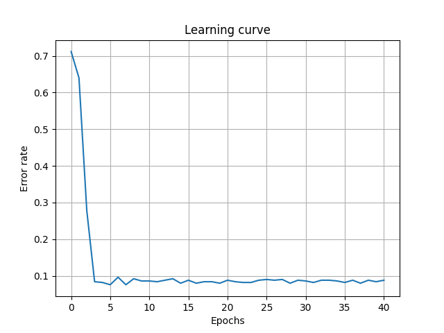

# Cross Quantum Classifier

A Python (and Q#) cross-platform implementation of a Variational Quantum Classifier using BLAS, QDK and QISKIT.

## Variational Quantum Classifier

This project implements a Variational Quantum Classifier inspired by the ["circuit-centric quantum classifier"](https://arxiv.org/abs/1804.00633) paper and other related works.

The circuit model is a network of 2-qubit rotation blocks that can be arranged in different configurations; any block has two settings: the rotation axis and the rotation angle. The set of rotation angles of the network represents the vector of the model parameters.

The training algorithm relies on the classical gradient descent optimization method (with momentum and a simple learning rate annealing schedule) to fit the vector of the model parameters to the training dataset. Both the classification function and the partial derivatives of the loss function for the gradient descent are calculated by quantum circuits.

## Cross-platform implementations of quantum circuits

All quantum circuits have been implemented using three different computation engines:

1. **BLAS** - a numeric simulation of quantum circuits based on basic linear algebra primitives (essentially matrix multiplications and tensor products) implemented in the *numpy* python package.
2. **QDK** - the **Microsoft Quantum Developmnet Kit** that provides either a local quantum simulator and the possibility to run quantum circuits on different Phisical Quantum Computers available as-a-service in Azure.
3. **QISKIT** - the **IBM Quantum Development Kit** that includes local quantum simulators and the native interface for the **IBM Q Experience** - an online platform that gives users public access to a set of IBM's quantum processors via the Cloud.

This makes it easier to compare results accuracy and performaces obtained by the usage of different versions of quantum simulators or physical quantum computers available as-a-service from different providers.

## Installation

The esiest way to have all the different Python SDKs available in the same environment is to use a 64-bit installation of [Anaconda](https://www.anaconda.com/) or [Miniconda](https://docs.conda.io/en/latest/miniconda.html).

    conda create -n xq -c quantum-engineering qsharp notebook
    conda activate xq
    pip install qiskit[visualization]

Moreover Microsoft QDK requires .NET Core SDK 3.1 to be installed.

A Docker file is also provided to build and run a fully configured image.

## Usage

Import the main module

    import xquantum as xq

Define the network circuit model arranging the RotationBlock gates and prepare the starting parameters vector 

    circuitModel = xq.CircuitModel([
        xq.RotationBlock(0,1,0,xq.Pauli.Y),
        xq.RotationBlock(1,2,1,xq.Pauli.Y),
        xq.RotationBlock(2,3,2,xq.Pauli.Y),
        xq.RotationBlock(3,0,3,xq.Pauli.Y),
        xq.RotationBlock(1,3,4,xq.Pauli.Y),
        xq.RotationBlock(2,0,5,xq.Pauli.Y)
    ], 0, 6)

    parameters = [0, 0, 0, 0, 0, 0, 0]

Set the hyper parameters for the training algorithm

    hyperParams = xq.HyperParams(
        epochs=40, 
        batchSize=30, 
        shots=200, 
        learningRate=0.157, 
        decay=0.02, 
        momentum=0.9, 
        padding=True, 
        pad=0.1)

Configure the computation engine

    # Linear algebra simulation
    engine = xq.Engine(xq.EngineType.BLAS, { 'derivativeMethod' : 1 })

    # Microsoft QDK - local simulator
    engine = xq.Engine(xq.EngineType.QDK, {})

    # IBM Qiskit - local simulator
    xq.Engine(xq.EngineType.QISKIT, {})
    
    # IBM Qiskit - IBM Q Experience
    engine = xq.Engine(xq.EngineType.QISKIT, {
        'account': 'xxxxxxxxxx',
        'providerGroup' : 'open',
        'providerProject' : 'main',
        'providerBackend' : 'ibmq_santiago'
    })

Train the model

    (fittedParams, error, learningHystory) = xq.trainModel(
        engine, 
        circuitModel, 
        hyperParams, 
        parameters, 
        trainingSetFeatures, 
        trainingSetLabels)

Plot the learning curve

    plt.plot(learningHystory['Epoch'], learningHystory['Error'])
    plt.xlabel('Epochs')
    plt.ylabel('Error rate')
    plt.title('Learning curve')
    plt.grid(True)
    plt.show()

Check the accuracy of the trained model on the validation set

    Confusion Matrix
    [[156   7]
     [  2  45]]
    Classification Report
                  precision    recall  f1-score   support

             0.0       0.99      0.96      0.97       163
             1.0       0.87      0.96      0.91        47

        accuracy                           0.96       210
       macro avg       0.93      0.96      0.94       210
    weighted avg       0.96      0.96      0.96       210

## License 

[Apache License 2.0](LICENSE)